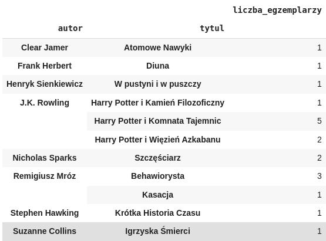

# Spotkanie nr 7: operacje na plikach łączonych w bibliotece
## Przygotowanie do zadań
### Import danych
**Dane wciąż w przygotowaniu**
### Założenia 
Plik `list_of_books.csv` zawiera listę egzamplarzy książek w biblitece. W kolumnach znajdują się takie informacje jak:
- **tytul**
- **autor**
- **rok_wydania**
- **numer** unikalny numer identyfikacyjny egzemplarz książki

Plik `list_of_users.csv` zawiera liste użytkowników zapisanych w biblitece. W kolumnach znajdują się takie informacje jak:
- **imie**
- **nazwisko**
- **numer_uzytkownika** unikalny numer identyfikujacy użytkonika
Specyficznym przypadkiem jest użytkownik **Konto Bibliotekarza**, które przeprowadza takie operacje **zakup**.

Plik `operations.csv` zawiera listę operacji wykonanych na egzemplarzach książek w bibliotece przez danych użytkowników.
- **numer_uzytkownika**
- **numer** referancja do egzemplarza książki
- **operacja** wyróżnia się trzy operacje `wypozyczenie`, `oddanie` i `zakup`
- **data_operacji** 
## Zadania
#### Zadanie 1. Policz liczbę egzemplarzy książek każdego tytuły. Tabele powinna zawierać w kolumnie pierwszej autora, w drugiej tytuł, w trzeciej liczbę egzemplarzy danej pozycji książkowej.
**Oczekiwany wynik:**  

#### Zadanie 2. Wylistuj egzemplarze książek wraz z aktualnym statusem. Tabela ma przedstawiać kolumny autor, tytuł, numer, operacja i jej data.

#### Zadanie 3. Wylistuj użytkowników i liczbę wypożyczeń (przyjmuj, że wypożczenie się liczy nawet jeśli użytkownik jeszcze nie oddał jakiejś książki)
#### Zadanie 4. Wylistuj książki i liczbę ich wypożyczeń (przyjmuj, że wypożczenie się liczy nawet jeśli użytkownik jeszcze nie oddał jakiejś książki)
#### Zadanie 5. Wylistuj użytkowników z liczbą książek aktualnie wypożyczonych.
#### Zadanie 6. Wylistuj użytkowników z liczbą wypożyczonych-zwróconych książek i średnią dni wypożecznia.
